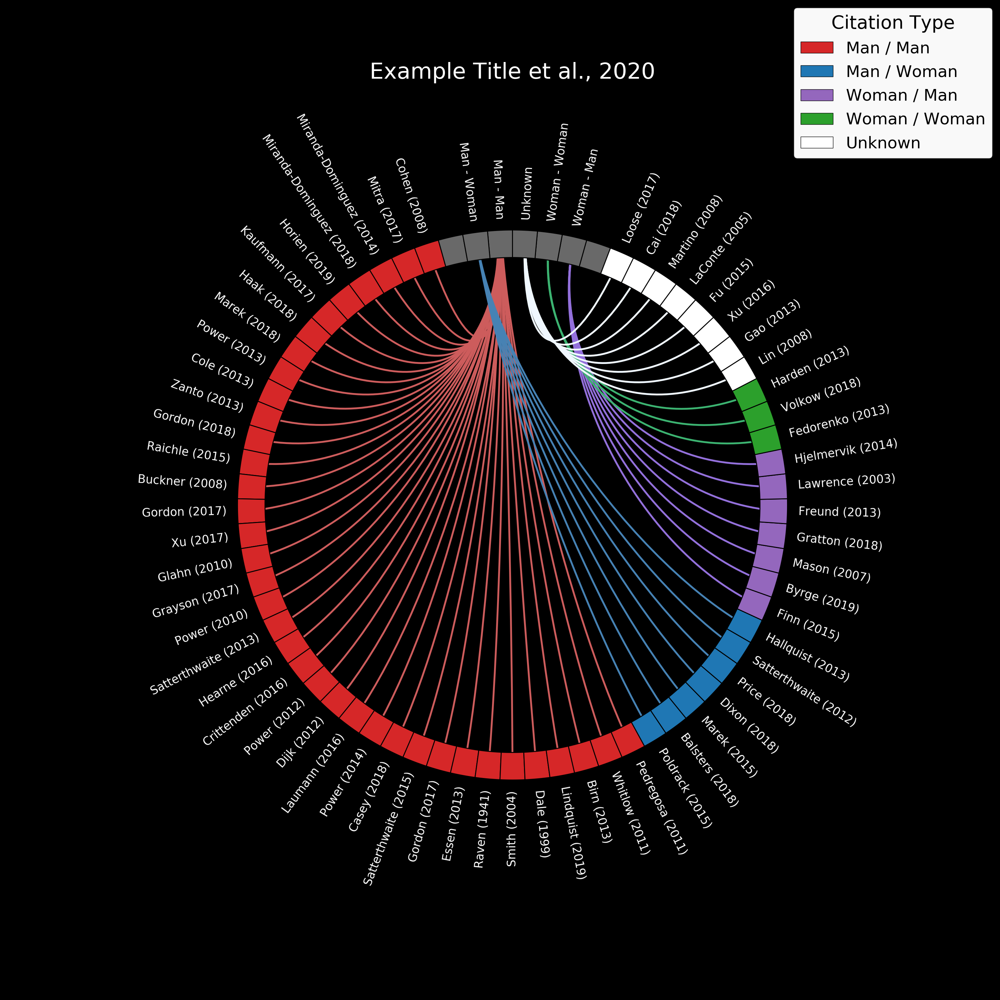

<p align="center"></p> 

# Gender Representation in Citations - Circle Visualization

[](https://www.python.org/downloads/release/python-374/)
[](https://travis-ci.com/iamdamion/grepCIRCLE)
[](https://www.codacy.com/manual/iamdamion/grepCIRCLE?utm_source=github.com&amp;utm_medium=referral&amp;utm_content=iamdamion/grepCIRCLE&amp;utm_campaign=Badge_Grade)
[](https://opensource.org/licenses/MIT)
[](https://zenodo.org/badge/latestdoi/274774425)

(Originally created by Damion V. Demeter during the OHBM Brainhack - June, 17 2020)

This quick script is intended as a visulization "add-on" for the [Gender Diversity Statement and Code Notebook (cleanBib)](https://github.com/dalejn/cleanBib) [1], which was motived by [Dworkin et al., 2020](https://doi.org/10.1038/s41593-020-0658-y) [2]. This script takes the "Authors.csv" output created by the [cleanBib](https://github.com/dalejn/cleanBib) code notebook (or a manually created csv can be created from the example in this repository) as an input. It then creates a circle graph that can aid in quickly assessing the gender representation of your reference list, using previously published labels [2]. It is intended as a visual supplement to your diversity statement or to visually track your papers' citation over time. 

See planned updates list for upcoming improvements. Suggestions and pull requests are always welcome!  
Use this freely wherever it can help (please cite if applicable). 

## Python Requirements and Usage
See requirement.txt file for current version python library requirements. 

Script usage output below:
```
usage: grepCIRCLE.py authors_csv [OPTIONS]

positional arguments:
  authors_csv           FULL path to Authors.csv file. (created with cleanBib [1] tool)

optional arguments:
  -h, --help            show this help message and exit

  -ccol [CCOL [CCOL ...]]
                        Connections color list: Enter 5 SPACE separated
                        matplotlib color names. Req order: MM, MW, WM, WW,
                        Unknown (DEFAULT: [red blue purple green white])

  -lcol LCOL            Legend background color. Must be matplotlib color
                        string. (DEFAULT = white)

  -ncol [NCOL [NCOL ...]]
                        Node color list: Enter 6 SPACE separated matplotlib
                        color names. Req order: labels, MM, MW, WM, WW,
                        Unknown (DEFAULT: [dimgrey red blue purple green
                        white])

  -o OUT_DIR            Location for saved circle graph image. (DEFAULT = pwd)

  -t TITLE [TITLE ...]  Title for circle graph. (DEFAULT = None)

  -q                    Quiet mode suppresses all QA/extra info printouts.
                        (Errors always printed)

  -v, --version         show program's version number and exit
```

## Input and User Options
File Inputs:  
The only hard-required input is an Authors.csv file. (See Example_Cleaned_Authors.csv for format). This file is typically created using the cleanBib [1] notebook, however, the example template can be used to create this file manually. 

User Options:  
The default colors for the output follows the color scheme outlines in Dworkin et al., 2020 [1], but each group of colors can be changed via input options. See -h (script help) for details and updates, but at the time of this release, the node colors and connection colors take space separated lists. The legend patches uses the node color scheme and can not be definted separately. The legend background can also be changed (to ease the b/w contrast). 


## References:
> [1] [D. Zhou, E. J. Cornblath, J. Stiso, E. G. Teich, J. D. Dworkin, A. S. Blevins, and D. S. Bassett, “Gender diversity statement and code notebook", v1.0, Zenodo, doi:10.5281/zenodo.3672109](https://github.com/dalejn/cleanBib) 

> [2] [J. D. Dworkin, K. A. Linn, E. G. Teich, P. Zurn, R. T. Shinohara, and D. S. Bassett, “The extent and drivers of gender imbalance in neuroscience reference lists,” Nat Neurosci (2020). https://doi.org/10.1038/s41593-020-0658-y](https://doi.org/10.1038/s41593-020-0658-y) 

## Planned Updates
- [ ] Order citations by year and add optional argument to highlight papers newer than X years
- [ ] Update order of source nodes and other small aesthetic updates
- [ ] Add metrics window on right side of circle with counts of citation types and confidence of gender from genderAPI
